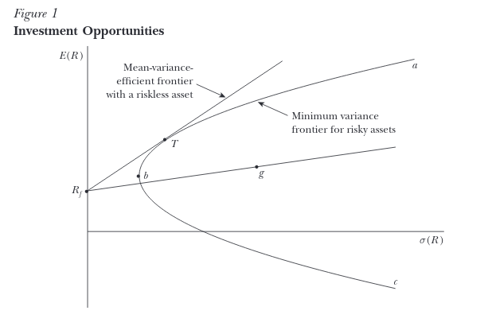
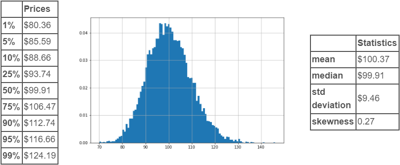
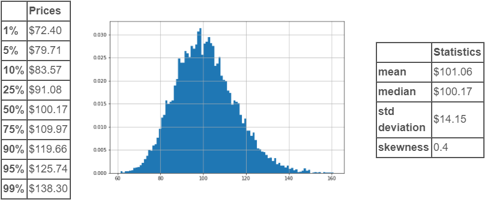
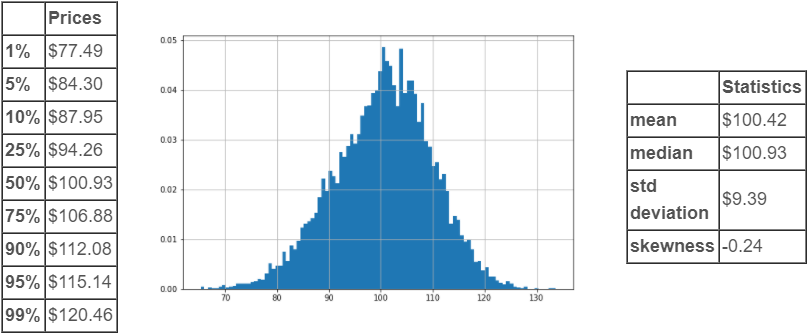
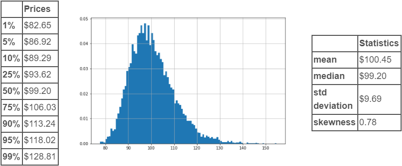
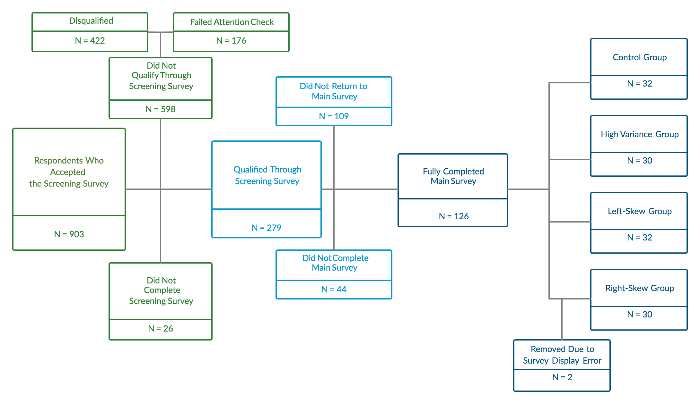

```{r setup, include=FALSE}
knitr::opts_chunk$set(echo = FALSE)

#Packages used in analysis
library(data.table)
library(knitr)
```

## Background on the Capital Asset Pricing Model

The Capital Asset Pricing Model (CAPM) and related models have arisen through the efforts of many renowned economists in the postwar period starting with Markowitz’s seminal 1952 essay on ‘Modern Portfolio Theory’ (MPT). Markowitz conceived of the portfolio construction problem as rooted in mean-variance ratio optimization. This line of research has since branched out into several related theories and conceptualizations of the portfolio construction process, rooted in the same fundamental idea that the optimal portfolio or set of portfolios can be identified through a sort of mean-variance optimization procedure. CAPM is one of the specific branches of Modern Portfolio Theory, and perhaps the most important as measured by its prominence in both undergraduate and graduate finance curricula. 

One of the more widely discussed CAPM models up to the present time is that researched by Sharpe (1964) and Linter (1965), wherein the capital market line is introduced as a concept. This line is modeling the linear relationship between the expected return in excess of the risk-free rate and a quantification of risk of an asset, or in the words of Sharpe himself: “[An investor] may obtain a higher expected rate of return on his holdings only by incurring additional risk.”

CAPM has been a pillar of valuation as taught in most MBA programs throughout the United States and has received much attention from both practitioners as well as academics as a baseline model for relating expected risk to expected return across asset classes. Fama and French give a good synopsis of the state of the research as of their work in 2004-2005. A brief description of the distinctions and assumptions of the Sharpe-Lintner and Black Models of CAPM follows.

The CAPM builds on the work of Markowitz’s mean-variance efficiency model where risk-averse investors only care about the mean and variance of the distribution of returns (prices). Given a targeted mean, they minimize variance. Given a targeted variance, they maximize the mean. The coordinates of maximized mean returns given variance and minimized variance given a mean produce the locus of a parabola, also known as the “efficient frontier” for risky assets. In this case ‘efficiency’ is denoting that the mean is maximized given a variance, or that the variance is minimized given a mean, as described above. Going forward, this parabola will be referred to as the ‘minimum variance frontier’ to avoid confusing with the mean-variance efficient frontier introduced in CAPM. It is depicted in Figure 1 as the parabola $abc$.

Sharpe (1964) and Lintner (1965) extended this framework to what is now called the CAPM. Two new assumptions are introduced. First and of key significance to our present research is that all market participants agree upon the distribution of returns or equivalently the distribution of future prices. Secondly, the ability to engage in unlimited borrowing and lending at the risk-free rate is assumed. When these assumptions are introduced, a line (technically ray) is formed with its point on the y-axis at the level of the risk-free rate (point $R_f$). For example, some asset g may have mean and variance as shown in the below plot, with (1) mixing cash and $g$ being to the left of $g$ on the line and (2) borrowing cash to purchase more of $g$ falling on the right of $g$ on the line.

To find a mean-variance efficient portfolio, we pivot the “line” anchored at $R_f$ on the y-axis up and to the left until we reach a tangency with the aforementioned parabola (point $T$). Having found this line, we have maximized the ratio of expected return to expected variance for risky assets subject to the existing minimum variance frontier. This is what Sharpe calls the ‘capital market line’ in his 1964 paper. Its slope is estimated as the quantity $\beta$.


Therefore, one way to directly test the validity of CAPM is to ascertain whether investors in practice are capable of ‘drawing’ this line in a manner consistent with CAPM, given a common distribution of returns, when variance increases, the demanded risk premium should also increase *ex ante*. 

Fischer Black (1972) also contributed his own spin-off of CAPM, which differed mainly in trading off the assumption of unlimited borrowing and lending at the risk-free rate for one of unlimited short-selling. Another implication of this model is that the y-intercept of the line in Figure 1 is not necessarily the risk-free rate, but potentially any rate lower than the market rate of return, which yields a less restrictive model. However, he still postulates that the slope of the mean-variance efficiency line ($\beta$) is positive.

Of additional significance to the motivation behind this paper, skewness is not contemplated by CAPM as a factor that could potentially impact the relative pricing of assets. In other words: could the relationship depicted in Figure 1 actually be multivariate linear in variance and skewness rather than just univariate in variance?

## Justification for Additional Experimentation

While the empirical justification for CAPM has received much attention by way of observational studies, including the prominent work by Fama and French (2004), and even some experimental settings such as Bossaerts and Plott (2002), we believe that our design has the potential to add upon existing literature in several interesting ways by taking on the 'shared distribution' assumption of Sharpe-Lintner in performing an *ex ante* measurement of responsiveness of risk premia to changing variance as well as testing for a significant effect of changing skewness from a reference distribution.

Fama and French conclude that CAPM is not actually valid in most applications given the explanatory power of other factors in estimating differential returns across assets besides contribution to portfolio variance. Since their study was an observational study, we can provide a supplementary experimental study in an attempt to more clearly support or refute the causal implications behind CAPM as an explanatory model of differential returns. One way to test this hypothesis is to control for expectations of future price distributions of an asset, and then collect the maximum price a subject is willing to pay for a given distribution. This is related to the assumption of the Sharpe-Lintner formulation of CAPM wherein all investors are assumed to be observing the same distribution of returns. If we can directly alter the perceived distribution of returns for different groups of investors, we may be able to measure the empirical effects proposed by this leg of the theory. To put it another way, if we can show that CAPM’s causal implications are supported by an *ex ante* analysis predicated on varying future distributions of asset prices, then the fact that other factors have explanatory power in an observational model does not necessarily invalidate the CAPM. Besides potentially finding the opposite, we could also find there is no evidence of a demand function response to changing the variance of distributions of future prices, then we might say that the Sharpe-Lintner CAPM formulation and its reliance on the “shared distribution” assumption is undermined by the results, since varying the distribution of asset prices has no causal relationship with the response price.

Under CAPM, only the mean and the variance of the distribution of future prices should be relevant to valuation decisions, with skewness or perceptions of skewness being irrelevant to the portfolio optimization process.  Kozik and Larson (2001) object to the exclusion of skewness, claiming it is both statistically and economically significant. Our experiment will test the hypothesis that skewness has a null effect on the implied risk-premium derived from the respondents’ self-reported maximum purchase price for the asset. There have also been observational studies that suggest that historical skewness in asset returns contains some information about future prices, but given that these are observational studies of realized price movements, it is difficult to ascertain the market’s true expectations of conditional distributions of future returns, especially since options markets seem not to truly operate on the Black-Scholes-Merton assumption of risk neutrality in the context of tail risks. The existence of a risk preference in options pricing is revealed through analysis of the so-called ‘volatility skew’, or the difference in implied volatilities between higher and lower strike prices given an underlying and time-to-expiry.

In order to test these hypotheses, it may be informative to test whether the microeconomic theory behind CAPM holds for individual stock market participants on an *ex ante* basis. In order to accomplish this, one must be able to actually cause variation in the perception of an individual subject’s distribution of future returns before measuring their price response. A clear and robust assessment of the accuracy of CAPM in practice must then be done with an experiment by which we can in some sense control for the ex-ante expectations of asset returns. Furthermore, in order to control what may be widely divergent expressions of baseline risk preference and accomplish a more accurate measurement, a within-subjects design may be required to reduce error in measuring the effects of any transformations applied to the distribution of asset returns, e.g., changing the variance of the future prices.

We assume that respondents will assume a positive correlation between these notional assets and the market as a whole, which is the case for the overwhelming majority of securities. While we do not explicitly identify Beta, given a correlation coefficient with the market, Beta increases as the variance of the idiosyncratic asset increases and thus we consider this test to be sufficiently direct although not ideal.  While this is not ideal, we determined that the additional theoretical clarity may come at the expense of engagement from respondents, given the limitations of the electronic survey format.

## Statement of Hypotheses

We formally state our research hypotheses as the following:

Controlling for individual differences in risk preferences, increasing the variance of the distribution of future asset prices will lead to investors demanding a larger risk premium (i.e., that the difference between the mean of the distribution and the maximum price they are willing to pay for the asset will become more positive).
Null Hypothesis: Increasing the variance of the distribution of future prices has no effect on the risk premium demanded
Alternative Hypothesis particular to CAPM: Increasing the variance of the distribution of future prices increases the risk premium demanded
Controlling for individual differences in risk preferences, making the skewness of a distribution of future asset prices more positive or more negative will have a significant effect on the risk premium demanded by investors.
Null Hypothesis: More negative or more positive skewness has no effect on the risk premium demanded
Alternative Hypothesis: More negative or more positive skewness has some effect on the risk premium demanded

In relating the above hypotheses to an intuitive interpretation, we propose the following understanding in light of previous research: The former will serve as a direct test of the mean-variance optimization framework on an individual level, while the latter will serve as a test of the excludability of skewness as a consideration from the formulations of CAPM proffered by Sharpe (1964), Lintner (1965) and Black (1972).

# Experimental Design

In order to test these hypotheses, we formulated an experiment with pretest-posttest control group design, utilizing the following experimental grammar:

To collect the reference observation (i.e. the first of the observations within the grammar described above), each subject was presented with the same hypothetical distribution of 3-month potential outcomes for an unnamed security and asked to report the maximum price they would be willing to pay for this security today, taking into account the potential for both profit and loss. Thereafter, to collect the outcome observation (i.e. the second of the observations within the grammar described above), they were presented with a second hypothetical distribution of 3-month potential outcomes based on the group they were randomized into, and asked to provide the same maximum valuation for this security.

The second distribution that the subject was presented with depended on which of the following 4 groups they were randomized into:

1. *Control*: Subjects in the control group were presented with the reference distribution once again. Presenting the same distribution twice acts as a diagnostic check to ensure consistency between scenarios, i.e. there is no significant change caused solely by the presentation of a second scenario to a subject. Ideally, the difference between responses would be minimal (if any) given that the respondent was presented with the same distribution in both cases.

2. *High variance*: Subjects in the high variance condition were presented with a distribution bearing ~50% greater standard deviation than the reference diagram. If CAPM were to be supported by this experiment, subjects would be expected to pay less for this security with higher variance.

3. *Left skew*: Subjects in the left skew group were presented with a distribution bearing a similar standard deviation to the reference diagram, but a negative skew. If CAPM were to be supported by this experiment, there would be no significant change in valuation based on this alteration to skewness and the left skew group would behave similarly to the control group.

4. *Right skew*: Subjects in the right skew group were presented with a distribution bearing a similar standard deviation to the reference diagram, but a more positive skew. If CAPM were to be supported by this experiment, there would be no significant change in valuation based on this alteration to skewness and the right skew group would behave similarly to the control group.

Utilizing the data collected through this structure, the following experimental outcomes were measured:

+ Individual respondent outcomes:

  + $pre-test\ risk\ premium\ =\ mean\ value\ of\ reference\ distribution\ -\ reported\ maximum\ price\ for\ reference$
  
  + $post-test\ risk\ premium\ =\ mean\ of\ treatment\ group\ distribution\ -\ reported\ maximum\ price\ for\ outcome$
  
  + $delta\ =\ post-test\ risk\ premium\ -\ pre-test\ risk\ premium$
  
    + A positive $delta$ would indicate that the respondent provided a lower maximum valuation in the outcome condition, i.e. they were willing to pay less for the security represented by the second distribution they were presented.
  
+ Aggregate outcomes:

  + $ATE\ =\ mean\ of\ delta\ in\ treatment\ -\ mean\ of\ delta\ in\ control$
  
    + A positive $ATE$ would indicate that maximum valuations were, in aggregate, lower in the outcome conditions than in the reference conditions

Thereafter, randomization inference and t-tests were conducted on the collected responses, comparing control to each of the other three outcome conditions. This allowed us to determine if the data support or reject the hypotheses outlined above.

# Materials

The distributions that were displayed to respondents were first generated through a Python script, included within the [Github repository for this project](https://github.com/john-woolley/w241-final-project). In particular, the `SciPy` and `SymPy` libraries to generate skew-normal distributions with given mean and variance. The quantiles of these distributions and their summary statistics (mean, median, standard deviation, and skewness) were calculated using `SciPy` and `Pandas`. Additionally, the distributions were plotted using the `matplotlib` library. The formulated visuals, as displayed to respondents, were as follows:

*Reference/Control:*


*High Variance:*


*Left Skew:*


*Right Skew:*


Thereafter, a survey was created within the Qualtrics platform to facilitate randomization of subjects, display of these distributions, and collection of responses. In particular, the following two-step survey design was utilized:

1. *Screening survey*: We set up an initial survey for use in screening respondents to assess their candidacy to participate in our research effort. This screening survey can be [previewed online through Qualtrics](https://berkeley.ca1.qualtrics.com/jfe/preview/SV_9N6bWgjwkBIqOsl?Q_CHL=preview&Q_SurveyVersionID=current). As a high-level overview, it contained the following segmentation:

  + *Demographics*: Respondents were first asked to provide their age, state of permanent residence, gender identity, and household income to determine if any key demographic trends would arise in analysis of the data.
 
  + *Utilization of online finance tools*: Respondents then indicated the types of online financial transactions that they have undertaken in the past five years. In particular, the survey queried if they have purchased/sold market securities through an online brokerage, opened a checking/saving account through an online bank, or purchased/sold cryptocurrency. Those who indicated purchase of a market security were asked how many security trades they have made in their lifetime (to the nearest magnitude of 10), allowing any respondent with 1 or more to proceed. As a quality control measure, respondents were presented with follow-up questions asking the specific vendors that they had utilized in their transactions, with disqualifying red herring options interspersed.
 
  + *Familiarity with statistics*: Respondents were asked when they last took a statistics course, allowing us to permit only those who had taken a high-school level statistics course or higher, given the nature of the questions that would be asked of them in the main survey.
 
2. *Main survey*: We set up a secondary main survey for use in randomly assigning qualified respondents into a condition, showing the to assess their candidacy to participate in our research effort. This main survey can be [previewed online through Qualtrics](https://berkeley.ca1.qualtrics.com/jfe/preview/SV_2gEc1inmt7HiLQx?Q_CHL=preview&Q_SurveyVersionID=current). As a high-level overview, it contained the following segmentation:

  + *Trading history*: The first two questions of the main survey queried the trading strategies employed by the respondent and the percentage distribution of lifespans of their trades, giving us the opportunity to assess if differences existed based on these inherent characteristics.
 
  + *Introduction*: As an introduction to the distributions, each respondent was presented with a sample distribution, including the quantiles, summary statistics, and plotted distribution. The interpretation of these tables and chart were explained to the respondent.

  + *Reference observation*: The respondent then viewed the reference distribution and provided their maximum valuation for the security, as well as a short explanation for this valuation.

  + *Outcome observation*: The respondent then viewed the second distribution, based on which group they were randomized into by the Qualtrics platform, and provided their maximum valuation for this security, as well as a short explanation for this valuation.

  + *Debrief*: The respondent was then asked to indicate if they recall the second distribution changing in width or lean. Based on their response, they were asked to indicate if the distribution appeared wider or narrower, and if the lean appeared to be left or to the right. To avoid any possibility of miscommunication due to statistical understanding, these follow-up questions were asked visually, using sample charts to visualize the potential changes.

Subjects for the survey were sourced via Amazon Mechanical Turk, a service that provides resources to complete Human Intelligence Tasks (HITs). While these resources are most often utilized for web scraping and creating training sets for machine learning purposes, we were able to leverage them as respondents within our survey. This was particularly selected as the pricing model allowed us to set our own incentive amounts to manage costs.

Following data collection, the raw response data was loaded in CSV format into Microsoft Excel, allowing rapid merging of the data from the screening and main surveys. Thereafter, the merged CSV data was imported into and analyzed in R. In particular, the `data.table` package was used to select data, run statistical tests, and display appropriate visualizations.

```{r}
#Dataset
data = fread('data/survey_data.csv')

#Histogram of Control Group
control_group = data[Treatment == 1, .(ref = Q2_1_1, obs = Q3_1_1, refdif = 100.37 - Q2_1_1, obsdif = 100.37 - Q3_1_1)]
control_group[, dif := obsdif - refdif]
hist_control<-hist(control_group$dif, breaks = 99)

#Histogram of High Variance
highvar_group = data[Treatment == 2, .(ref = Q2_1_1, obs = Q4_1_1, refdif = 100.37 - Q2_1_1, obsdif = 101.06 - Q4_1_1)]
highvar_group[, dif := obsdif - refdif]
highvar_combined = rbind(highvar_group, control_group)
hist_highvar<-hist(highvar_group$dif, breaks = 99)

#Histogram Left Skew
leftskew_group = data[Treatment == 3, .(ref = Q2_1_1, obs = Q5_1_1, refdif = 100.37 - Q2_1_1, obsdif = 100.42 - Q5_1_1)]
leftskew_group[, dif := obsdif - refdif]
leftskew_combined = rbind(leftskew_group, control_group)
hist_lskew<-hist(leftskew_group$dif, breaks = 99)

#Histogram Right Skew
rightskew_group = data[Treatment == 4 & is.na(Error), .(ref = Q2_1_1, obs = Q6_1_1, refdif = 100.37 - Q2_1_1, obsdif = 100.45 - Q6_1_1)]
rightskew_group[, dif := obsdif - refdif]
rightskew_combined = rbind(rightskew_group, control_group)
hist_rskew<-hist(rightskew_group$dif, breaks = 99)

#Random Inference High Variance
highvar_ate = highvar_group[, mean(dif)] - control_group[, mean(dif)]
highvar_list = c()
for(i in 1:1000){
 highvar_combined[, random := rbinom(.N, 1, highvar_group[, .N] / (highvar_group[, .N] + control_group[, .N]))]
 highvar_list[i] = highvar_combined[random == 1, mean(dif)] - highvar_combined[random == 0, mean(dif)]
}
ri_highvar<-hist(highvar_list, breaks = 20)
abline(v = highvar_ate)
highvar_p1 = sum(highvar_list > abs(highvar_ate) | highvar_list < -abs(highvar_ate)) / length(highvar_list)

#Random Inference Left Skew
leftskew_ate = leftskew_group[, mean(dif)] - control_group[, mean(dif)]
leftskew_list = c()
for(i in 1:1000){
 leftskew_combined[, random := rbinom(.N, 1, leftskew_group[, .N] / (leftskew_group[, .N] + control_group[, .N]))]
 leftskew_list[i] = leftskew_combined[random == 1, mean(dif)] - leftskew_combined[random == 0, mean(dif)]
}
ri_lskew<-hist(leftskew_list, breaks = 20)
abline(v = leftskew_ate)
leftskew_p = sum(leftskew_list > abs(leftskew_ate) | leftskew_list < -abs(leftskew_ate)) / length(leftskew_list)

#Random Inference Right Skew
rightskew_ate = rightskew_group[, mean(dif)] - control_group[, mean(dif)]
rightskew_list = c()
for(i in 1:1000){
 rightskew_combined[, random := rbinom(.N, 1, rightskew_group[, .N] / (rightskew_group[, .N] + control_group[, .N]))]
 rightskew_list[i] = rightskew_combined[random == 1, mean(dif)] - rightskew_combined[random == 0, mean(dif)]
}
ri_rskew<- hist(rightskew_list, breaks = 20)
abline(v = rightskew_ate)
rightskew_p = sum(rightskew_list > abs(rightskew_ate) | rightskew_list < -abs(rightskew_ate)) / length(rightskew_list)

#Percentage Identifying Table
pidt<-data.frame(
 "Partial ID" = c('-','46.67% (14/30)','43.75% (14/32)','50.00% (15/30)'),
 "Perfect ID" = c('18.75% (6/32)','33.33% (10/30)','12.50% (4/32)','16.67% (5/30)')
 )
row.names(pidt)<-c('Control','High Variance','Left-Skew','Right-Skew')

```

### Analysis 
 
The survey was set up to be active for a total of five days. At the end of this duration, a total of 903 individuals took the screening survey on Mechanical Turk. Of these 903, 598 respondents were screened out of the main survey by the aforementioned attention checks (176), or were otherwise deemed unfit for the main survey on the grounds of having not participated in online securities trading in the past five years (422). An additional 26 individuals were removed due to a failure to complete the screening survey. The rest of the 279 respondents were then sent a message containing an anonymous link to the main Qualtrics survey. A total of 153 respondents did not complete the main survey. 44 did not complete the main survey. 109 did not follow through to Qualtrics from the anonymous link given to them and were removed from the dataset. The remaining 126 respondents completed the survey. Two respondents received incorrect graphs for their treatment group and were removed. The rest were evenly divided into four groups (Control, High Variance, Left-Skew, Right-Skew). The group selection was made in the backend by Qualtrics’ pseudo-randomization algorithm before surveys were completed. 

 

Exploratory data analysis was first conducted on resulting data to query data quality. For each of the groups, the difference between question two (treatment) and question one (baseline) was calculated to determine the treatment effect for each respondent. These were then plotted as histograms to view the distribution of the population. 

```{r dist,fig.width=10,fig.height=10,fig.cap='Population distribution for (a) Control, (b) High Variance, (c) Left-Skew, (d) Right-Skew '}
#2x2 histogram
line = 1
cex = 2
side = 3
adj=-0.05

par(mfrow=c(2,2), oma=c(1,6,1,1))
hist(control_group$dif, breaks = 99, main='Control')
mtext("a)", side=side, line=line, adj=adj)
hist(highvar_group$dif, breaks = 99, main='High Variance')
mtext("b)", side=side, line=line, adj=adj)
hist(leftskew_group$dif, breaks = 99, main='Left-Skew')
mtext("c)", side=side, line=line, adj=adj)
hist(rightskew_group$dif, breaks = 99, main='Right-Skew')
mtext("d)", side=side, line=line, adj=adj)
mtext('figure label',side=1,outer=TRUE,line=1)
```

For the Control Group, both questions used the same graph with no variation or skewness. As a result, it would be expected that the respondents would reply with the same value for both questions, rendering the mean difference as zero. As seen in **Figure X** a, the majority of respondents had zero or close to zero mean deltas. However there are some outliers at -90 and -50 respectively. As a result, the average mean delta for the control group is -6.08. This was the first sign that the quality of respondents will need additional scrutiny. Similar outliers also appear in Left-Skew (**Figure X** c) and Right-Skew (**Figure X** d) groups. 

```{r}
kable(pidt,caption = "Percentage Identifying Treatment Condition",align="c")
```


Because of some of these suspicious answers, a follow-up examination of respondent comprehension was conducted using the results of the survey debriefing question. In this question, respondents were asked to identify the difference between the first and second graphs they were presented. The expectation was that respondents who understood the question and were able to interpret the graphs presented to them would be able to point out the differences between the graphs. However, as seen in **Table X**, the overall identification of treatment was very poor. As part of this analysis, perfect identification as well as partial identification were examined. A respondent was considered to have perfectly identified the treatment if they responded with only the factors that changed between their graphs. If they mentioned factors that did not change, they were placed into partial identification instead. Less than 50% of respondents correctly identified any factor that changed between graphs. This signaled that there were issues with the results that were collected. Either the respondents were unable to interpret the graphs given to them, or they had begun to fill out the survey on autopilot. Both of these scenarios will hinder the accuracy of the results. However we had no a priori principles by which to exclude outliers, therefore they were left in the study.

```{r ri,fig.width=10,fig.height=10,fig.cap='Randomization Inference '}
#2x2 histogram
line = 1
cex = 2
side = 3
adj=-0.05

par(mfrow=c(2,2), oma=c(1,6,1,1))
hist(highvar_list, breaks = 20, main='High Variance')
abline(v = highvar_ate)
mtext("a)", side=side, line=line, adj=adj)
mtext(paste(c('p =',highvar_p1),collapse=' '), side=side, line=line-5, adj=adj+.1)
hist(leftskew_list, breaks = 20, main='Left-Skew')
abline(v = leftskew_ate)
mtext(paste(c('p =',leftskew_p),collapse=' '), side=side, line=line-5, adj=adj+.1)
mtext("b)", side=side, line=line, adj=adj)
hist(rightskew_list, breaks = 20, main='Right-Skew')
abline(v = rightskew_ate)
mtext(paste(c('p =',rightskew_p),collapse=' '), side=side, line=line-5, adj=adj+.1)
mtext("c)", side=side, line=line, adj=adj)
mtext('figure label',side=1,outer=TRUE,line=1)
```

Randomization inference was used to generate p-values for each of the treatment conditions in comparison to control. Of High Variance (**Figure X**), Left-Skew (**Figure X**) and Right-Skew (**figure**), both Left-Skew (0.047) and Right-Skew (0.014) returned significant p-values at the 95% confidence level. Additionally, pairwise t-tests (**Table**) were also conducted on the samples. We report Bonferroni adjusted p-values. When uncorrected, both Left-Skew and Right-Skew t-tests returned significant p-values at the 95% confidence level. However when corrected, neither were significant. 

**TODO: T-Test Tables**

# Discussion

Taken at face value, the data analysis indicates that there is no statistically significant change in respondents' reported risk premiums between the control condition and the high variance. As such, the findings do not support our initial hypothesis that CAPM will be demonstrated within this audience of retail investors. However, our secondary hypothesis that there will be a significant difference in risk premiums with subjects in the left skew and right skew conditions did prove to be supported by the data. The positive ATE indicates that respondents in these treatment conditions were more risk averse and provided a smaller maximum valuation for the outcome distribution they were presented. That said, we would not be inclined to take these results at face value. 

During exploratory data analysis, the outliers responses in each of the conditions immediately came to light. Within the control group, the outliers skewed the mean delta heavily in the negative direction, as opposed to the expectation of zero. The qualitative responses provided by the subjects did not give us reason to believe that there was any particular reason for this difference, other than indifference to the experiment. This created a poor frame of reference for the other conditions.

At the same time, in each of the two treatment groups with statistically significant outcomes, the outliers (likely also a result of indifference to the experiment) skewed the mean deltas heavily into the positive direction. When these positive mean deltas for treatment were compared against the negative mean delta for control, the resultant ATEs were relatively large and statistically significant. 

With this in mind, we do not believe that this provides an accurate representation of risk tolerance and calculation among retail traders. We accordingly recommend revisiting the experiment with a larger N, potentially reducing the overall impact of outlier responses when averaged among a larger group. Additional considerations and recommendations for a second run of this experiment are provided in the **Future Directions** segment below.

## Limitations

Through the course of the experiment, there were a number of platform limitations in both platforms used to conduct the survey, Mechanical Turk and Qualtrics. Many of the issues lead to an increase in respondents attriting (*figure**) between surveys or half-way through a survey. Had these limitations been known beforehand, the experiment design could have been adjusted to accommodate. Unfortunately these limitations were discovered while conducting the experiment. 

Mechanical Turk is subject to factors outside of experimental control. For example, surveys on Mechanical Turk are often subject to peer review. External websites like TurkOpticon are filled with users who post reviews for surveys being hosted on Mechanical Turk. These can act as positive or negative incentives for users on the platform. For example if a survey has overly negative reviews like “Too complicated for compensation offered”, other users will be disincentivized from attempting the survey. This effect is not consistent across the entire Mechanical Turk population either, as these are external review sites that not all users will use. Additionally, it is unfeasible to track the rating of this experiment’s survey across all the variety of Mechanical Turk survey review sites to ensure zero effect. 

This experiment was also limited by the compensation that was offered. With a budget of $500, each respondent was offered $0.70 - $1.10. For a survey dealing with mathematics and thought intensive questions, the survey may inch into the “too troublesome” category for most respondents. As the experiment filtered for American residents, the demographic (**citation**) of respondents would be people who consider Mechanical Turk as a secondary source of income. There will be additional bias introduced by attrition from users who feel the survey is not worth the compensation offered based on the time that is needed to complete the survey. For other users, the poor compensation could also lead to autopilot survey responses or thoughtless answers, which is poor data for drawing conclusions from. 

In addition to the attrition from poor compensation, the utilization of two separate platforms for the experiment proved to be a big source of attrition. Nearly half the respondents who passed the screening survey (109/279) on Mechanical Turk did not follow through to Qualtrics to complete the main survey. This may also be related to poor compensation. Doubtless there are many one part jobs that offer the same amount of compensation as this experiment. The hassle of switching to a new website also contributes to the attrition rate. 

Qualtrics also had its own share of shortcomings. The survey link to Qualtrics was an anonymous link. This caused issues when respondents left the survey midway through. When they returned, Qualtrics considered them as a new responder. Since we cannot distinguish between individuals who left and those who left but later completed the survey, attrition estimates for respondents who did not complete the survey are not very accurate. Qualtrics also employs pseudo random assignments to fill groups. As groups fill up, some positive adjustments are applied to less full groups in order to match the other groups. As a result there will be some time effects involved with treatment assignment. Additionally, respondents who leave partway through the survey can be assigned a different treatment each time they enter the survey. 

After the survey results were collected, the quality of responses were also brought into question. As mentioned previously, there were some suspicious responses to all parts of the main survey. Besides the illogical responses, it was clear that not all respondents may have understood the question being posed from analysis of the survey debriefing. This is likely a combination of bad faith responses not being filtered and poor understanding of the questions being posed. As a result, the results of the experiment are also drawn into question. 

## Future Directions

The fundamental structure of the survey will likely need to be changed. As seen from the survey responses, the majority of respondents had no stake in the problem. With a fake scenario with fake money on the line, it is no wonder that there were joke responses mixed into the results. Having some stakes built into the survey would help gather serious responses. The obvious answer would be to give respondents money to invest in the stock market with the promise of giving them whatever they make over the course of the experiment. However this will bring up ethical concerns, where we are directly altering the distributions of returns while retaining profit and loss for the respondents. 

Another possibility of raising stakes would be tying compensation amount to performance. In this scenario, the experiment would be set up to have four dummy stocks in which respondents will be able to invest their pseudo-currency. Before the experiment, the respondents will be notified that their compensation will be tied to their performance. This will serve as a motivation to properly tackle the problems being posed. 

In order to collect reliable data, the survey will need to be adjusted to better identify individuals who do not understand the concepts being presented to them. As seen from the debriefing results, the single statistics and risk analysis filtering question was not able to ensure that respondents could interpret the graphs given to them. The addition of questions asking respondents to glean information from the graph (such as quartile, mean, skew) would serve as a method to determine comprehension. 

The typical demographic(**citation**) for Mechanical Turk users are younger people with lower incomes that use Mechanical Turk as a secondary source of income. Therefore the typical population of respondents will be people who do not have the luxury of investing into stocks and gaining experience. With the level of compensation offered on Mechanical Turk, the chances of gathering a sample with a high proportion of individuals with sophisticated understanding of financial economics is quite low. The typical experiment would thus consist of this demographic and not be representative of the population as a whole. This problem can also be solved by choosing a population of individuals who would understand, such as college-educated economics students or those who work in the industry. 

Another potential line of research is to incentivize participants and also reveal the implications of competitive behavior by conducting ‘auctions’ for the distributions of returns. By conducting an auction, we both include competitive pressure on the demand side as well as reveal more information about the demand curves of participants in the case of re-bids, or those who originally offered a price only to be outbid who later submit a second price. We believe that the bidding pressure in an auction format may be more effective in measuring people’s actual preferences rather than a survey.

When considering the population of the study, another fundamental question needs to be answered: is it important for the average person to understand the concepts of CAPM? It can be argued that CAPM only needs to be followed by the people at the top who move large amounts of money in the market. That it doesn’t matter if the average person who sometimes performs market transactions does not follow this principle as long as the majority of transactions in the market do. Therefore, rather than querying the general population, market makers or managers of large asset portfolios would be the more appropriate audience than the general population of traders for such an experiment. 

## Citations

- Djellel Difallah, Elena Filatova, and Panos Ipeirotis. 2018. Demographics and Dynamics of Mechanical Turk Workers. In Proceedings of the Eleventh ACM International Conference on Web Search and Data Mining (WSDM '18). Association for Computing Machinery, New York, NY, USA, 135–143. DOI:https://doi.org/10.1145/3159652.3159661

