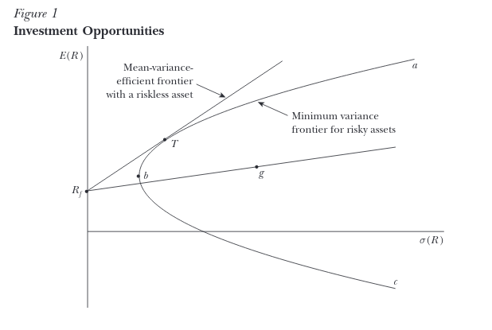

```{r setup, include=FALSE}
knitr::opts_chunk$set(echo = TRUE)
```

## Background on the Capital Asset Pricing Model

The Capital Asset Pricing Model (CAPM) and related models have arisen through the efforts of many renowned economists in the postwar period starting with Markowitz’s seminal 1952 essay on ‘Modern Portfolio Theory’ (MPT).  Markowitz conceived of the portfolio construction problem as rooted in mean-variance ratio optimization.  This line of research has since branched out into several related theories and conceptualizations of the portfolio construction process, rooted in the same fundamental idea that the optimal portfolio or set of portfolios can be identified through a sort of mean-variance optimization procedure.  CAPM is one of the specific branches of Modern Portfolio Theory, and perhaps the most important as measured by its prominence in both undergraduate and graduate finance curricula.  

One of the more widely discussed CAPM models up to the present time is that researched by Sharpe (1964) and Linter (1965), wherein the capital market line is introduced as a concept.  This line is modeling the linear relationship between the expected return in excess of the risk-free rate and a quantification of risk of an asset, or in the words of Sharpe himself: “[An investor] may obtain a higher expected rate of return on his holdings only by incurring additional risk.”

CAPM has been a pillar of valuation as taught in most MBA programs throughout the United States and has received much attention from both practitioners as well as academics as a baseline model for relating expected risk to expected return across asset classes.  Fama and French give a good synopsis of the state of the research as of their work in 2004-2005. A brief description of the distinctions and assumptions of the Sharpe-Lintner and Black Models of CAPM follows.

The CAPM builds on the work of Markowitz’s mean-variance efficiency model where risk-averse investors only care about the mean and variance of the distribution of returns (prices).  Given a targeted mean, they minimize variance.  Given a targeted variance, they maximize the mean.  The coordinates of maximized mean returns given variance and minimized variance given a mean produce the locus of a parabola, also known as the “efficient frontier” for risky assets.  In this case ‘efficiency’ is denoting that the mean is maximized given a variance, or that the variance is minimized given a mean, as described above.  Going forward, this parabola will be referred to as the ‘minimum variance frontier’ to avoid confusing with the mean-variance efficient frontier introduced in CAPM.  It is depicted in Figure 1 as the parabola $abc$.

Sharpe (1964) and Lintner (1965) extended this framework to what is now called the CAPM.  Two new assumptions are introduced.  First and of key significance to our present research is that all market participants agree upon the distribution of returns or equivalently the distribution of future prices. Secondly, the ability to engage in unlimited borrowing and lending at the risk-free rate is assumed.  When these assumptions are introduced, a line (technically ray) is formed with its point on the y-axis at the level of the risk-free rate (point $R_f$).  For example, some asset g may have mean and variance as shown in the below plot, with (1) mixing cash and $g$ being to the left of $g$ on the line and (2) borrowing cash to purchase more of $g$ falling on the right of $g$ on the line.

To find a mean-variance efficient portfolio, we pivot the “line” anchored at $R_f$ on the y-axis up and to the left until we reach a tangency with the aforementioned parabola (point $T$).  Having found this line, we have maximized the ratio of expected return to expected variance for risky assets subject to the existing minimum variance frontier.  This is what Sharpe calls the ‘capital market line’ in his 1964 paper.  Its slope is estimated as the quantity $\beta$.


Therefore, one way to directly test the validity of CAPM is to ascertain whether investors in practice are capable of ‘drawing’ this line in a manner consistent with CAPM, given a common distribution of returns, when variance increases, the demanded risk premium should also increase *ex ante*.  

Fischer Black (1972) also contributed his own spin-off of CAPM, which differed mainly in trading off the assumption of unlimited borrowing and lending at the risk-free rate for one of unlimited short-selling.  Another implication of this model is that the y-intercept of the line in Figure 1 is not necessarily the risk-free rate, but potentially any rate lower than the market rate of return, which yields a less restrictive model.  However, he still postulates that the slope of the mean-variance efficiency line ($\beta$) is positive.

Of additional significance to the motivation behind this paper, skewness is not contemplated by CAPM as a factor that could potentially impact the relative pricing of assets.  In other words: could the relationship depicted in Figure 1 actually be multivariate linear in variance and skewness rather than just univariate in variance?

## Justification for Additional Experimentation

While the empirical justification for CAPM has received much attention by way of observational studies, including the prominent work by Fama and French (2004), and even some experimental settings such as Bossaerts and Plott (2002), we believe that our design has the potential to add upon existing literature in several interesting ways by taking on the 'shared distribution' assumption of Sharpe-Lintner in performing an *ex ante* measurement of responsiveness of risk premia to changing variance as well as testing for a significant effect of changing skewness from a reference distribution.

Fama and French conclude that CAPM is not actually valid in most applications given the explanatory power of other factors in estimating differential returns across assets besides contribution to portfolio variance.  Since their study was an observational study, we can provide a supplementary experimental study in an attempt to more clearly support or refute the causal implications behind CAPM as an explanatory model of differential returns. One way to test this hypothesis is to control for expectations of future price distributions of an asset, and then collect the maximum price a subject is willing to pay for a given distribution.  This is related to the assumption of the Sharpe-Lintner formulation of CAPM wherein all investors are assumed to be observing the same distribution of returns.  If we can directly alter the perceived distribution of returns for different groups of investors, we may be able to measure the empirical effects proposed by this leg of the theory.  To put it another way, if we can show that CAPM’s causal implications are supported by an *ex ante* analysis predicated on varying future distributions of asset prices, then the fact that other factors have explanatory power in an observational model does not necessarily invalidate the CAPM.  Besides potentially finding the opposite, we could also find there is no evidence of a demand function response to changing the variance of distributions of future prices, then we might say that  the Sharpe-Lintner CAPM formulation and its reliance on the “shared distribution” assumption is undermined by the results, since varying the distribution of asset prices has no causal relationship with the response price.

Under CAPM, only the mean and the variance of the distribution of future prices should be relevant to valuation decisions, with skewness or perceptions of skewness being irrelevant to the portfolio optimization process.   Kozik and Larson (2001) object to the exclusion of skewness, claiming it is both statistically and economically significant. Our experiment will test the hypothesis that skewness has a null effect on the implied risk-premium derived from the respondents’ self-reported maximum purchase price for the asset.    There have also been observational studies that suggest that historical skewness in asset returns contains some information about future prices, but given that these are observational studies of realized price movements, it is difficult to ascertain the market’s true expectations of conditional distributions of future returns, especially since options markets seem not to truly operate on the Black-Scholes-Merton assumption of risk neutrality in the context of tail risks.  The existence of a risk preference in options pricing is revealed through analysis of the so-called ‘volatility skew’, or the difference in implied volatilities between higher and lower strike prices given an underlying and time-to-expiry.

In order to test these hypotheses, it may be informative to test whether the microeconomic theory behind CAPM holds for individual stock market participants on an *ex ante* basis.  In order to accomplish this, one must be able to actually cause variation in the perception of an individual subject’s distribution of future returns before measuring their price response. A clear and robust assessment of the accuracy of CAPM in practice must then be done with an experiment by which we can in some sense control for the ex-ante expectations of asset returns. Furthermore, in order to control what may be widely divergent expressions of baseline risk preference and accomplish a more accurate measurement, a within-subjects design may be required to reduce error in measuring the effects of any transformations applied to the distribution of asset returns, e.g., changing the variance of the future prices.

We assume that respondents will assume a positive correlation between these notional assets and the market as a whole, which is the case for the overwhelming majority of securities.  While we do not explicitly identify Beta, given a correlation coefficient with the market, Beta increases as the variance of the idiosyncratic asset increases and thus we consider this test to be sufficiently direct although not ideal.   While this is not ideal, we determined that the additional theoretical clarity may come at the expense of engagement from respondents, given the limitations of the electronic survey format.


## Statement of Hypotheses

We formally state our research hypotheses as the following:

Controlling for individual differences in risk preferences, increasing the variance of the distribution of future asset prices will lead to investors demanding a larger risk premium (i.e., that the difference between the mean of the distribution and the maximum price they are willing to pay for the asset will become more positive).
Null Hypothesis: Increasing the variance of the distribution of future prices has no effect on the risk premium demanded
Alternative Hypothesis particular to CAPM: Increasing the variance of the distribution of future prices increases the risk premium demanded
Controlling for individual differences in risk preferences, making the skewness of a distribution of future asset prices more positive or more negative will have a significant effect on the risk premium demanded by investors.
Null Hypothesis: More negative or more positive skewness has no effect on the risk premium demanded
Alternative Hypothesis: More negative or more positive skewness has some effect on the risk premium demanded

In relating the above hypotheses to an intuitive interpretation, we propose the following understanding in light of previous research: The former will serve as a direct test of the mean-variance optimization framework on an individual level, while the latter will serve as a test of the excludability of skewness as a consideration from the formulations of CAPM proffered by Sharpe (1964), Lintner (1965) and Black (1972).
